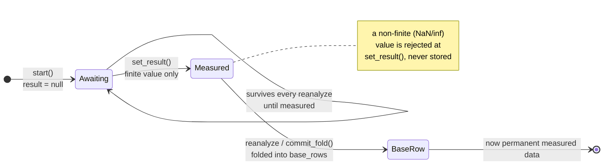

# Campaign loop

The closed optimization loop behind the kalos-web `/decide` surface, and the campaign identity, lineage, and activity data a campaign-scoped workspace (many named campaigns, a lineage graph, a daily activity heatmap) is built on.

## Why

The engine proposes a batch of recipes, but until a scientist can run those recipes, record what they measured, and get the *next* batch that accounts for those results, kalos is a one-shot analysis viewer, not a product.
This is the loop that closes: propose -> run -> log outcome -> re-propose.

It deliberately reuses the existing analysis path (`_analyze` in `kalos/portal/analysis.py`) and adds no new engine capability.
A campaign is just a growing dataset that gets re-analyzed each round.

## The loop at a glance


The engine boxes (`_analyze`, seed, fold) are pure re-runs of the existing analysis path; the human steps (pick recipes, run in the lab) are where the round actually advances.
Each trip around the loop grows `base_rows` by the runs that were measured, so the next proposed batch accounts for them.

## Concept

A **campaign** is one optimization target plus a growing table of (recipe -> measured outcome) rows.

- **base rows**: the dataset the analysis fits on. Seeded from an `/api/run` upload, then grows as logged runs are folded in.
- **pending runs**: recipes the scientist started from a proposed batch. Each is either *awaiting* a measured outcome (`result: null`) or *measured* (`result` filled), waiting to be folded into base on the next re-analyze.

A tenant may own **many campaigns** at once — see "Campaign identity" below. Each campaign is a row in `<KALOS_STATE_DIR>/portal.db` (default `~/.kalos`), keyed by `(tenant, campaign_id)`, guarded by a lock and written in a SQLite transaction, mirroring the `_LATEST` state pattern in `kalos/portal/app.py`.

## Campaign identity

Every campaign carries:

- `id`: a stable UUID4 hex string, minted once when the campaign is created and never regenerated — the same id survives a process restart, because it lives inside the persisted row itself, not in memory.
- `name`: a human label. `POST /api/run` uploads default it to the uploaded file's name; a caller with nothing to offer gets `"Untitled campaign"`.
- `archived`: a boolean, absent (i.e. active) until someone archives the campaign. See "Archiving" below.

A tenant accumulates campaigns rather than replacing one: **every successful `/api/run` upload with no `campaign_id` creates its own new campaign** (its own `id`, its own `base_rows`, its own `pending`) instead of overwriting whatever the tenant already had. This is what lets a tenant hold many named, independently addressable campaigns - the left rail of the campaign-scoped workspace lists them via `GET /api/campaigns`.

That accumulation is bounded by two lifecycle operations, and by exactly two.
Neither of them ever hard-deletes anything, because in a regulated lab the record that a run happened has to outlive the scientist's interest in it:

- **Replace** (`POST /api/run?campaign_id=X`) corrects one campaign's uploaded base data in place, keeping its `id`, so a re-uploaded corrected run sheet fixes the campaign instead of spawning a duplicate. See "Replacing a campaign's data".
- **Archive** (`POST /api/campaign/archive`) retires a campaign from the rail and from every default resolution while keeping every row of it queryable by id. See "Archiving".

There is deliberately no delete endpoint, and no merge.

### How every route addresses a campaign

Every `/api/campaign*` route takes an optional `campaign_id` query parameter.

- **Given**: the route operates on exactly that campaign, or fails (`{"has_campaign": false}` on a read, `400`/`CampaignError` on a write) if it does not exist for the caller's tenant.
- **Omitted**: the route resolves it to the tenant's **most-recently-updated active** campaign - i.e. `max(updated_at)` across that tenant's un-archived campaigns, where `updated_at` is bumped by every mutation (`seed`, `replace`, `start`, `set_result`, `commit_fold`, `archive`, `unarchive`). This is a deliberate choice over a separate "active campaign" pointer: it needs no extra state to keep in sync, and it exactly reproduces the pre-identity single-campaign behavior for any caller that never passes an id - right after a fresh upload, the campaign just seeded IS the most recent, so `GET /api/campaign` (no id) shows it, `POST /api/campaign/start` (no id) appends to it, and so on. Every pre-identity call site keeps working unchanged.

Two routes are the exception and take a **required** `campaign_id`: `POST /api/campaign/archive` and `POST /api/campaign/unarchive`.
Falling back to "whichever campaign is current" is fine for a read or for appending a run, and actively dangerous for an operation that retires one, so a caller that forgets the parameter gets a 422 rather than a silently retired campaign.

`GET /api/campaigns` (plural, no id) lists every **active** campaign a tenant owns, most-recently-updated first, as `{id, name, target, n_base, best, round, n_awaiting, archived, updated_at}` - the left-rail brief.
`?include_archived=true` adds the archived ones back in, in the same order, distinguished by their `archived` field.
`GET /api/campaign` (singular) returns the full summary for one campaign (below), archived or not.

### Migration from the pre-identity layout

Before this feature, `campaigns` was `(tenant PRIMARY KEY, state, updated_at)` — one anonymous, unnamed campaign per tenant. Opening a `CampaignStore` against a `portal.db` written in that layout migrates it forward automatically and exactly once: the old table is renamed, the current `(tenant, campaign_id, state, updated_at)` table is created, each legacy row is assigned a fresh `id` and a generic `name` (`"Untitled campaign"`), and the old table is dropped. Because the minted id is written into the row itself, a second `__init__` against the same file sees the current schema already in place and never re-mints it — the id is stable across restarts, not just present after the first one.

The migration is genuinely atomic: the rename, the create, every insert, and the final drop all run inside one explicit `BEGIN IMMEDIATE` / `COMMIT` transaction (`CampaignStore._migrate_legacy_schema`), with a `ROLLBACK` on any failure. This matters because the RENAME/CREATE/DROP are DDL, which Python's `sqlite3` module runs in autocommit by default — a plain `with self._conn:` block does not actually cover DDL, only DML, so a crash between the CREATE and the DROP could otherwise leave an empty new table on disk plus the real data orphaned in the renamed-but-now-unreferenced legacy table, permanently, with the migration guard treating it as already done on every later restart. The explicit transaction closes that gap: any failure at any point during the migration leaves the on-disk db exactly as it was before the migration started, and the migration retries cleanly on the next `__init__`. The migration also logs at INFO when it starts and completes (rows read/migrated/skipped) and at WARNING for every corrupt legacy row it has to skip, so a partial or skipped migration is observable from the logs rather than silently indistinguishable from "this tenant never uploaded anything."

### A note on the generation-token guarantee and campaign identity

The re-analyze transaction (below) is completely unaffected in the case that matters: two writes to the **same** campaign still race exactly as before, and `commit_fold` still refuses to write if that campaign's `generation` changed underneath it. What changed is that a *fresh upload* no longer shares a row with any existing campaign — it seeds an unrelated one — so it can no longer force a spurious 409 on an in-flight reanalyze of a campaign it has nothing to do with. This is a strictly stronger isolation guarantee than before identity existed.

One subtlety this introduces: `plan_fold()` resolves `campaign_id` (explicit or default) and returns the id it actually used. `commit_fold()` must be called with **that exact id**, not left to re-resolve "the default campaign" a second time — if a fresh upload created a newer campaign in the interim, re-resolving would silently target the wrong campaign. `campaign_routes.reanalyze_campaign` threads the id through explicitly for this reason; `CampaignStore.commit_fold`'s own default-resolution fallback exists only for callers with a single campaign in play (e.g. direct store-level tests) and fails safe (`CampaignError`) rather than corrupting the wrong campaign if misused otherwise.

## Lineage

Every campaign records enough to reconstruct a lineage graph — runs as nodes, parent-to-child recipe descent as edges — without the client re-deriving it.

- **Folded base rows** (rows that came from a measured pending run, not the original upload) carry that run's `id`, `created_at`, and `measured_at` forward. This metadata lives in a parallel array (`base_row_meta`, one entry per `base_rows` row, `None` for original upload rows) — it is deliberately kept OUT of the DataFrame `_analyze` fits on, so it can never be mistaken for a modeled feature or corrupt the GP. It is surfaced via `GET /api/campaign`'s `lineage.folded_rows`: `[{run_id, created_at, measured_at}, ...]`.
- **Pending runs** carry `parent_ids` and `parent_row_count`, set at `POST /api/campaign/start` time: `parent_ids` is every base row this module can name (i.e. one folded from a prior measured run) at the moment the recipe was started; `parent_row_count` is the true total base row count, including originally uploaded rows with no traceable id.

**This is deliberately honest, not tidy.** A proposal genuinely descends from every row the GP fit on, not just the ones with a recorded id — a freshly seeded campaign's first batch of proposals has `parent_ids: []` (nothing folded yet has a run id to report) but `parent_row_count: N` (the true size of the base dataset it was conditioned on). Inventing ids for the original upload's rows to make the graph fully connected from round 0 would misrepresent data the engine does not actually have per-row identity for. A client rendering the lineage graph should draw an edge from each id in `parent_ids` and separately caption the untraceable remainder (`parent_row_count - len(parent_ids)`), rather than assume every parent is nameable.

## Activity series

`GET /api/campaign/activity` serves the per-day activity heatmap: `{"has_campaign": true, "id": "...", "days": [{"date": "YYYY-MM-DD", "runs": N}, ...], "stats": {"days_running": N, "days_with_runs": N, "longest_pause_days": N}, "note": "..."}`, or `{"has_campaign": false}` if the campaign_id does not resolve.

A "run" counted here is any pending run OR already-folded base row (via `base_row_meta`) that carries a real `measured_at` — i.e. every recipe that was actually measured, whether or not a re-analyze has since folded it into `base_rows`. Awaiting (never-measured) runs are not counted; there is no "well" concept anywhere in this series — cells are runs-measured-per-day, nothing else (the engine has deliberately never modeled wells, and this does not introduce one).

**Timezone: UTC, always.** `created_at`/`measured_at` are unix floats with no recorded timezone, so bucketing them into calendar days needs a fixed convention or the same data would disagree across two viewers in different timezones. Every day boundary in `days` and every derived stat uses `datetime.fromtimestamp(ts, tz=timezone.utc).date()`.

Derived stats, computed over the sparse set of days that have `runs > 0` (the response does not zero-fill the full calendar range — a client renders the grid and fills gaps from the sparse points, the common heatmap pattern):

- `days_running`: the inclusive span, in days, between the first and last active day (`(last - first).days + 1`).
- `days_with_runs`: the count of distinct active days.
- `longest_pause_days`: the largest number of fully idle days between two consecutive active days (`max((later - earlier).days - 1)`; `0` if there are fewer than two active days).

**Known limitation — the series is honest but partial.** The originally uploaded base dataset (`seed()`) has no per-row timestamps at all; only rows that passed through the campaign loop (`POST /api/campaign/start` -> measured -> optionally folded) carry a `measured_at`. The response's `note` field says this explicitly, so a client can caption the heatmap truthfully ("campaign-loop activity only") rather than implying it covers every row in the dataset.

Every pending run walks a strict one-way lifecycle - and an *awaiting* run can never skip a step and silently become a data point:



## State shape (`<KALOS_STATE_DIR>/portal.db`, table `campaigns`)

One row per `(tenant, campaign_id)`, `state` a JSON blob shaped:

```json
{
  "id": "5f2c9e1a7b3d4c8e9a0b1c2d3e4f5061",
  "name": "2026-08 methanol sweep",
  "archived": false,
  "revisions": [{"replaced_at": 1690000000.0, "name": "2026-08 methanol sweep (typo).csv", "n_base": 40}],
  "target": "lipase_titer",
  "features": ["pH", "Methanol"],
  "base_rows": [{"pH": 6.5, "Methanol": 2.0, "lipase_titer": 4.6}],
  "base_row_meta": [null],
  "pending": [
    {
      "id": "b1e2...",
      "recipe": {"pH": 6.46, "Methanol": 2.29},
      "pred": 1.58, "std": 0.33, "mode": "explore", "reason": "diversifies the batch",
      "result": null,
      "created_at": 1690000000.0,
      "measured_at": null,
      "parent_ids": [],
      "parent_row_count": 1
    }
  ],
  "round": 2,
  "updated_at": 1690000000.0,
  "generation": "3f9a1c8b..."
}
```

`features` and `target` come from the analysis result (`proposal_features`, `target`), so the campaign never guesses column roles - it takes them from the engine.
`generation` is re-minted on every single write (`seed`, `start`, `set_result`, `commit_fold`); a re-analysis captures the generation it planned against and refuses to commit if it changed underneath - see "Re-analyze = the loop closing" below.
`base_row_meta` is lineage bookkeeping, parallel to `base_rows` (see "Lineage" above) - `null` for an originally uploaded row, `{run_id, created_at, measured_at}` for one folded in from a measured pending run. It is never fed to `_analyze`.
`archived` and `revisions` are both absent on a campaign that has never been archived or replaced; absent `archived` reads as active (see "Archiving"), absent `revisions` as an empty list.

## Seeding

A new campaign is created whenever `/api/run` succeeds **without a `campaign_id`** - see "Campaign identity" above; it does not replace any existing campaign.
`_run_uploaded_sync` (`kalos/portal/app.py`) already holds the parsed `df` and calls `_analyze` then `_save_latest`; it also seeds a fresh campaign from `(df, result["target"], result["proposal_features"])`, named from the uploaded file.
A fresh upload always starts a fresh campaign (new id, new base, empty pending, round 0) and immediately becomes the tenant's default (most-recently-updated) campaign.

Seeding is **best-effort**: a failure is logged and swallowed, and the upload still returns its analysis with `campaign_id: null`.
The caller asked for an analysis and gets one; nothing they named was at stake.
Replacing is not best-effort - see below.

## Replacing a campaign's data

A scientist uploads a run sheet, spots a typo in it, and uploads the corrected file.
With plural campaigns and seed-on-every-upload, that leaves two campaigns: the wrong one and the right one, both in the rail, forever.
`POST /api/run?campaign_id=X` is the fix, and it is the ONLY behavioral difference the parameter makes:

- **omitted** (the default, unchanged): seed a brand new campaign.
- **given**: the uploaded file **replaces campaign X's base data in place**, keeping X's `id`. No second campaign is created.

### What replacing actually replaces

| Replaced | Kept |
| --- | --- |
| `base_rows` (the corrected file's rows) | `id` |
| `base_row_meta` (reset to all-`null`: every new row is an upload row, so none is traceable to a run) | `target` |
| `features` (from the fresh analysis) | `round` (always `0` here - see the refusals below) |
| `name` (the corrected file's name) | `pending` (every started run, verbatim) |
| `history` (reset to a single round-0 point over the new base) | `archived` |

`revisions` grows by one audit entry per replacement - `{replaced_at, name, n_base}` describing the base that was superseded - so the fact that a correction happened survives even though the superseded rows do not.

### What replacing REFUSES, and why refusing is the right call

A replace is rejected with a `400` and an explicit reason in three cases.
None of them is a silent no-op: the whole upload fails, and `/api/latest` is not written either.

1. **The campaign holds any measured result.** A measured pending run, a folded base row, or any completed round. This is the data-loss path and it is refused outright rather than acknowledged-away, because those numbers came out of a bioreactor and a data-entry correction has no business deleting them. They are also not reconcilable with a corrected base: a folded row descends from a proposal the GP conditioned on the *old* rows, and `history`/`best` would go on describing a dataset that no longer exists. The error names the way forward - upload the correction as a new campaign and archive this one - which loses nothing at all, because archiving is not deletion.
2. **The uploaded file analyzes a different `target`.** A campaign *is* one optimization target plus a growing dataset, so a different target is a different experiment, not a correction. This also keeps any preserved pending run coherent: its eventual result is folded in under this campaign's target, and it was never proposed against another one.
3. **The campaign is archived.** Unarchive it first; an archived campaign is a closed record.

Awaiting (never-measured) pending runs are deliberately **preserved**, not discarded.
A started run is physically in the lab; erasing the record that it was started, because the sheet it was proposed from had a typo, would be exactly the traceability loss this whole design is trying to avoid.
Their `parent_ids`/`parent_row_count` are left untouched and still describe the base as it stood when they were started - that is history, not a live pointer, and it is the honest reading of what the engine actually conditioned on.

### Replace and concurrency

`replace()` runs under the store's single lock and goes through the same `_write_locked` as every other mutation, so it mints a fresh `generation` and can never sneak past the `plan_fold`/`commit_fold` guard.

More strongly: **a replace and an in-flight re-analyze of the same campaign are mutually exclusive by construction, not by timing.**
`plan_fold` only succeeds when at least one run is measured, and at least one measured run is exactly the condition that makes `replace` refuse.
So a replace attempted during a re-analyze is rejected on its own merits, the re-analyze commits untouched, and there is no ordering of the two that loses data.

The replace is validated inside the store, under the store lock, *after* the analysis.
That is one authoritative check with no time-of-check-to-time-of-use window, at the cost of one wasted GP fit when the replace is refused.

## Archiving

`POST /api/campaign/archive?campaign_id=X` retires a campaign. It does **not** delete it, and there is no endpoint that does.

What archiving changes:

- The campaign disappears from `GET /api/campaigns` (it comes back with `?include_archived=true`, flagged `archived: true`).
- It can never be chosen by default resolution. This is enforced in `CampaignStore._resolve_default_locked`, i.e. in the one place every id-less route resolves through, so it holds for reads *and* writes: an id-less `POST /api/campaign/start` skips past an archived campaign to the next active one, and a tenant whose campaigns are all archived gets "no active campaign" rather than a surprise.
- It refuses writes. `start`, `result`, `reanalyze`, and `replace` all return `400` on an archived campaign until it is unarchived. Without this, an archived campaign could quietly advance rounds while invisible in the rail.

What archiving does not change:

- `GET /api/campaign?campaign_id=X` returns its full summary, including `archived: true`.
- `GET /api/campaign/activity?campaign_id=X` still serves its series.
- The row, its `base_rows`, its `base_row_meta`, its `pending` runs, and its `history` are all still on disk, untouched.

`POST /api/campaign/unarchive?campaign_id=X` reverses it.
Because unarchiving is a mutation like any other it bumps `updated_at`, so the campaign becomes the tenant's most-recently-updated one and therefore its default again - which is what a caller reaching for it explicitly meant.

`archived` lives inside the row's JSON `state` blob rather than in a new column: no schema change, no second migration path to get wrong, and a row written before archiving existed (including every row the legacy migration forward-ports) has no `archived` key and reads as active, which is the only safe default.

### Archiving and an in-flight re-analyze

An archive is a write, so it mints a fresh `generation` and a `commit_fold` planned before it refuses to land - the same guarantee every other concurrent write gets.
`commit_fold` checks `archived` *before* it checks the generation token, even though the token would trip anyway, purely so the error says what actually happened: the generic "please re-analyze again" would invite a retry that keeps failing until the campaign is unarchived.
The route surfaces it as a `409` with that message, nothing is folded, and `/api/latest` is not written.
Unarchive, re-analyze, and the same fold completes normally.

## Endpoints (`/api/campaign*` router, mounted like `/api/experiments`)

Every route below except `GET /api/campaigns` accepts an optional `?campaign_id=` query parameter - see "Campaign identity" above for how it resolves when omitted.

| Method | Path | Body | Does |
| --- | --- | --- | --- |
| GET | `/api/campaigns` | - | Every **active** campaign the caller's tenant owns, most-recently-updated first: `[{id, name, target, n_base, best, round, n_awaiting, archived, updated_at}, ...]`. The left-rail listing. `?include_archived=true` includes archived ones. |
| GET | `/api/campaign` | - | One campaign's summary for the `/decide` view (below), or `{"has_campaign": false}` if `campaign_id` does not resolve. |
| GET | `/api/campaign/activity` | - | Per-day runs-measured series + derived stats for one campaign - see "Activity series" above. |
| POST | `/api/campaign/start` | `{"recipes": [{recipe, pred, std, mode, reason}]}` | Append each recipe as a pending awaiting run. Returns the appended runs with ids (each carrying `parent_ids`/`parent_row_count` - see "Lineage" above). |
| POST | `/api/campaign/result` | `{"id": "...", "value": 3.2}` | Set the measured outcome on a pending run. 400 on unknown campaign/run id or non-finite value. |
| POST | `/api/campaign/reanalyze` | - | Fold every measured pending run into base rows, run `_analyze` on the grown dataset, and commit + `_save_latest`. Returns `{analysis, campaign}`. Awaiting runs stay pending. `400` if there is nothing new to fold or the campaign is archived; `409` if this campaign was written to (or archived) mid-analysis. See below. |
| POST | `/api/campaign/archive` | - | Retire one campaign: hidden from the rail and from every default resolution, all data still queryable by id, writes refused. `campaign_id` is **required** (422 without it). Returns the campaign's brief. `400` on an unknown id. Nothing is ever deleted - see "Archiving". |
| POST | `/api/campaign/unarchive` | - | Reverse an archive and make the campaign the tenant's most-recently-updated one again. `campaign_id` **required**. Returns the brief. |

One more endpoint outside this router participates in the campaign lifecycle:

| Method | Path | Body | Does |
| --- | --- | --- | --- |
| POST | `/api/run?campaign_id=X` | the run sheet (multipart) | Analyze the file and **replace campaign X's base data in place** instead of seeding a new campaign. `400` with an explicit reason if X does not exist, is archived, analyzes a different target, or already holds measured results - see "Replacing a campaign's data". Omitting `campaign_id` is the unchanged default: seed a new campaign. |

`GET /api/campaign` response:

```json
{
  "has_campaign": true,
  "id": "5f2c9e1a7b3d4c8e9a0b1c2d3e4f5061",
  "name": "2026-08 methanol sweep",
  "archived": false,
  "revisions": [],
  "target": "lipase_titer",
  "features": ["pH", "Methanol"],
  "n_base": 40,
  "best": 5.9,
  "round": 2,
  "history": [{ "round": 0, "best": 4.6, "n_base": 40 },
              { "round": 1, "best": 5.2, "n_base": 42 },
              { "round": 2, "best": 5.9, "n_base": 45 }],
  "pending": [{ "id": "...", "recipe": {...}, "pred": 1.58, "std": 0.33,
               "mode": "explore", "reason": "...", "result": null, "awaiting": true,
               "parent_ids": ["..."], "parent_row_count": 40 }],
  "n_awaiting": 3,
  "n_measured": 0,
  "lineage": {"folded_rows": [{"run_id": "...", "created_at": 1690000000.0, "measured_at": 1690000500.0}]}
}
```

`best` is `max(target over base_rows)` - the best *measured* value so far, not a prediction.
`history` is the progress trajectory: one `{round, best, n_base}` point per round (round 0 = the seeded base, then one per re-analyze), so the frontend can plot best-so-far converging.
Because base rows only grow, `best` is non-decreasing across the trajectory.

## Re-analyze = the loop closing

`reanalyze` is the whole point - and it is **transactional**, because `_analyze` is a multi-second GP fit and another write to the SAME campaign (a `start`, a `result`) can land right in the middle of it.
The naive "fold first, then analyze" ordering would let a failed analysis strand a half-advanced campaign, and let a concurrent write silently destroy the just-folded data.
So the fold is planned in memory, the analysis runs, and only then is the fold committed - and only if nothing changed underneath:

```mermaid
sequenceDiagram
    autonumber
    participant UI as /decide (browser)
    participant R as reanalyze route
    participant S as CampaignStore
    participant A as _analyze (worker thread)

    UI->>R: POST /api/campaign/reanalyze?campaign_id=C
    R->>S: plan_fold(campaign_id=C)
    Note over S: reads C's state, folds measured runs<br/>in memory — writes NOTHING
    S-->>R: (df, target, generation G1, campaign_id=C)
    R->>A: _analyze(df) — slow GP fit
    Note over S: a concurrent start()/result() on<br/>C may land here (generation G2);<br/>an /api/run upload seeds an UNRELATED<br/>campaign and cannot affect C at all
    A-->>R: analysis result
    R->>S: commit_fold(G1, campaign_id=C)
    alt generation still G1 (no write to C landed)
        S-->>R: committed — round + 1, new generation
        R->>R: re-check C's generation, then _save_latest
        R-->>UI: 200 {analysis, campaign}
    else generation changed (a write to C landed)
        S-->>R: CampaignError
        R-->>UI: 409 — retry, /api/latest untouched
    end
```

What each step guarantees:

1. **`plan_fold(campaign_id=C)`** reads campaign C's state, folds every measured pending run into a DataFrame *in memory*, and returns it with C's current `generation` token AND the resolved `campaign_id` itself. It writes nothing, so a later failure costs nothing. It rejects a re-analyze with no measured run to fold (that would only inflate the round).
2. **`_analyze`** runs on the grown DataFrame, off the event loop in a worker thread. If it raises, campaign C is still exactly as it was - a retry is meaningful.
3. **`commit_fold(generation, campaign_id=C)`** — called with the EXACT `campaign_id` `plan_fold` returned, never re-resolved — re-reads C's state and writes the fold (measured runs → `base_rows`, `round += 1`, new history point) **only if C's `generation` still matches**. Every write to C mints a fresh generation, so if a `set_result`/`start` landed on C during `_analyze`, the token differs and the commit is refused with a `409` - the analysis described a dataset that no longer exists, and nothing is written. A fresh `/api/run` upload elsewhere cannot trigger this at all: it seeds an unrelated campaign, never C's row (see "Campaign identity" above).
4. **`_save_latest`** publishes the fresh analysis to `/api/latest`, then the route returns it (same shape `GET /api/latest` returns) plus the updated campaign summary for C.

The next `/api/latest` and the next `GET /api/campaign?campaign_id=C` both reflect the folded-in data, so `/decide` shows a batch that accounts for the results just logged.
This adds no engine capability - it is the same `_analyze` the upload path runs, on a dataset that grew by one round.

### A note on `/api/latest` and the residual window

Campaign C's row is fully guarded by its `generation` token. `/api/latest` (`_LATEST`) is a *separate*, tenant-scoped (not campaign-scoped) resource with its own lock, and the upload path takes the two locks in the opposite order from the re-analyze path, so they cannot be spanned by a single lock without risking a deadlock.
The route therefore re-checks C's generation once more immediately before `_save_latest` and skips the write if a concurrent write to C landed in between.
This eliminates the entire multi-second race across `_analyze`; a sub-millisecond window between the final re-check and `_save_latest` remains.
Fully sealing it would require an ordered generation stamp on `_LATEST` itself so an older analysis can never overwrite a newer one - a deliberate follow-up, not shipped here, and negligible for a single-local-user localhost portal.

`_LATEST` itself is still one slot per tenant (not per campaign), so a multi-campaign tenant can only ever see the most recently analyzed campaign there - that has not changed. What changed: `_save_latest` now stamps every entry with `campaign_id` (the campaign that analysis came from, or `None` for the legacy `/api/single`/`/api/multi` demo routes, or a best-effort upload whose campaign seed failed), so `GET /api/latest` lets a campaign-aware client tell which campaign it is looking at instead of only a free-text `dataset` label. This is additive - `campaign_id` is a new key on an existing dict, so an existing reader that only reads the pre-existing fields is unaffected.

## Honesty constraints (do not regress)

- `best` is measured, never predicted.
- A run is only foldable once it has a real measured `result`; an awaiting run never silently becomes a data point.
- **Nothing is ever hard-deleted.** There is no delete endpoint. Archiving hides a campaign and keeps every row of it queryable; replacing a campaign's base data refuses outright if that would discard a measured result, preserves every started run, and records the fact of the correction in `revisions`. The record that a run happened has to outlive the scientist's interest in it.
- Re-analyze routes through the same leakage-controlled `_analyze`, so grouped-CV reliability, conformal bands, and the "not modeled" callouts stay first-class each round.
- Lineage never invents an id for a row the engine cannot actually trace (see "Lineage" above) - `parent_row_count` reports the true total even when `parent_ids` cannot name all of it.
- The activity series never implies coverage it does not have (see "Activity series" above) - its `note` field says explicitly that it covers campaign-loop runs only, not the original upload.

## Frontend contract (kalos-web)

`lib/api.ts` gains a campaign client: `listCampaigns(includeArchived?)`, `getCampaign(campaignId?)`, `getCampaignActivity(campaignId?)`, `startRuns(recipes, campaignId?)`, `logResult(id, value, campaignId?)`, `reanalyze(campaignId?)`, `archiveCampaign(campaignId)`, `unarchiveCampaign(campaignId)`, and an optional `campaignId` on the upload call so a re-upload can correct a campaign instead of duplicating it.
The campaign-scoped workspace uses it to drive three surfaces:

1. **Left rail** - `GET /api/campaigns` lists every active campaign; selecting one fixes `campaignId` for every subsequent call below. Archive is a per-row action, not a delete: label it "Archive", never "Delete", and put archived campaigns behind a "show archived" toggle (`?include_archived=true`) rather than dropping them from the UI entirely. A refused replace (`400` from `POST /api/run?campaign_id=...`) carries a specific, user-readable reason - surface it verbatim, since "upload this as a new campaign and archive this one" is an instruction the scientist can act on.
2. **The loop itself**, scoped to the selected campaign:
   - **Start** the queued proposals -> `POST /api/campaign/start?campaign_id=...`.
   - A **campaign panel** lists the real pending runs (`GET /api/campaign?campaign_id=...`) with a measured-value input per run -> `POST /api/campaign/result?campaign_id=...`.
   - Once runs are measured, **Re-propose with N results** -> `POST /api/campaign/reanalyze?campaign_id=...`, then refresh `getLatest()` (new batch) and `getCampaign(campaignId)`.
   - Best-so-far and round come from `GET /api/campaign?campaign_id=...`.
3. **Lineage graph** - nodes from `GET /api/campaign`'s `pending` (with `parent_ids`) and `lineage.folded_rows`; edges from each pending run's `parent_ids` to the folded rows they name. Caption the untraceable remainder (`parent_row_count - len(parent_ids)`) rather than drawing a fake edge for it.
4. **Activity heatmap** - `GET /api/campaign/activity?campaign_id=...`'s `days`/`stats`; render its `note` as a visible caption, not a tooltip footnote - the coverage gap (original upload rows are not represented) is real and a user could otherwise misread the heatmap as complete.
   `campaign_id` omitted anywhere above resolves server-side to the tenant's most-recently-updated campaign - useful for a "just show me the current one" default view, but the workspace should pass it explicitly once a campaign is selected in the left rail.
