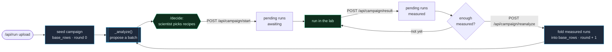
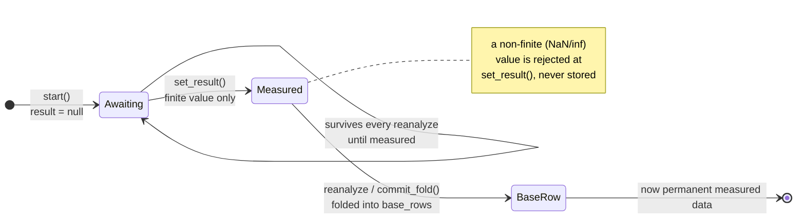
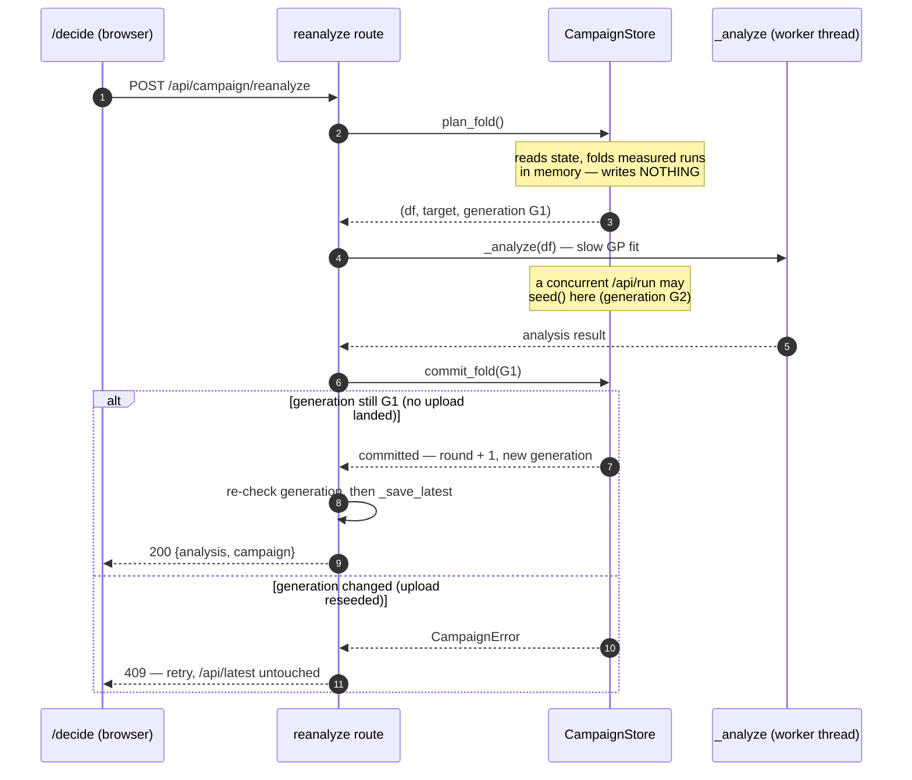

# Campaign loop

The closed optimization loop behind the kalos-web `/decide` surface.

## Why

The engine proposes a batch of recipes, but until a scientist can run those recipes, record what they measured, and get the *next* batch that accounts for those results, kalos is a one-shot analysis viewer, not a product.
This is the loop that closes: propose -> run -> log outcome -> re-propose.

It deliberately reuses the existing analysis path (`_analyze` in `kalos/portal/analysis.py`) and adds no new engine capability.
A campaign is just a growing dataset that gets re-analyzed each round.

## The loop at a glance



The engine boxes (`_analyze`, seed, fold) are pure re-runs of the existing analysis path; the human steps (pick recipes, run in the lab) are where the round actually advances.
Each trip around the loop grows `base_rows` by the runs that were measured, so the next proposed batch accounts for them.

## Concept

A **campaign** is one optimization target plus a growing table of (recipe -> measured outcome) rows.

- **base rows**: the dataset the analysis fits on. Seeded from the last `/api/run` upload, then grows as logged runs are folded in.
- **pending runs**: recipes the scientist started from a proposed batch. Each is either *awaiting* a measured outcome (`result: null`) or *measured* (`result` filled), waiting to be folded into base on the next re-analyze.

One campaign at a time (single local user). It lives in `~/.kalos/campaign.json`, guarded by a lock and written atomically, mirroring the `_LATEST` state pattern in `kalos/portal/app.py`.

Every pending run walks a strict one-way lifecycle - and an *awaiting* run can never skip a step and silently become a data point:



## State shape (`~/.kalos/campaign.json`)

```json
{
  "target": "lipase_titer",
  "features": ["pH", "Methanol"],
  "base_rows": [{"pH": 6.5, "Methanol": 2.0, "lipase_titer": 4.6}],
  "pending": [
    {
      "id": "b1e2...",
      "recipe": {"pH": 6.46, "Methanol": 2.29},
      "pred": 1.58, "std": 0.33, "mode": "explore", "reason": "diversifies the batch",
      "result": null,
      "created_at": 1690000000.0,
      "measured_at": null
    }
  ],
  "round": 2,
  "updated_at": 1690000000.0,
  "generation": "3f9a1c8b..."
}
```

`features` and `target` come from the analysis result (`proposal_features`, `target`), so the campaign never guesses column roles - it takes them from the engine.
`generation` is re-minted on every single write (`seed`, `start`, `set_result`, `commit_fold`); a re-analysis captures the generation it planned against and refuses to commit if it changed underneath - see "Re-analyze = the loop closing" below.

## Seeding

The campaign base is seeded/replaced whenever `/api/run` succeeds.
`_run_uploaded_sync` (`kalos/portal/app.py`) already holds the parsed `df` and calls `_analyze` then `_save_latest`; it also seeds the campaign from `(df, result["target"], result["proposal_features"])`.
A fresh upload starts a fresh campaign (new base, empty pending, round 0).

## Endpoints (`/api/campaign` router, mounted like `/api/experiments`)

| Method | Path | Body | Does |
| --- | --- | --- | --- |
| GET | `/api/campaign` | - | Campaign summary for the `/decide` view (below), or `{"has_campaign": false}` before any upload. |
| POST | `/api/campaign/start` | `{"recipes": [{recipe, pred, std, mode, reason}]}` | Append each recipe as a pending awaiting run. Returns the appended runs with ids. |
| POST | `/api/campaign/result` | `{"id": "...", "value": 3.2}` | Set the measured outcome on a pending run. 400 on unknown id or non-finite value. |
| POST | `/api/campaign/reanalyze` | - | Fold every measured pending run into base rows, run `_analyze` on the grown dataset, and commit + `_save_latest`. Returns `{analysis, campaign}`. Awaiting runs stay pending. `400` if there is nothing new to fold; `409` if the campaign was reseeded mid-analysis (retry). See below. |

`GET /api/campaign` response:

```json
{
  "has_campaign": true,
  "target": "lipase_titer",
  "features": ["pH", "Methanol"],
  "n_base": 40,
  "best": 5.9,
  "round": 2,
  "history": [{ "round": 0, "best": 4.6, "n_base": 40 },
              { "round": 1, "best": 5.2, "n_base": 42 },
              { "round": 2, "best": 5.9, "n_base": 45 }],
  "pending": [{ "id": "...", "recipe": {...}, "pred": 1.58, "std": 0.33,
               "mode": "explore", "reason": "...", "result": null, "awaiting": true }],
  "n_awaiting": 3,
  "n_measured": 0,
  "analysis_in_sync": true
}
```

`best` is `max(target over base_rows)` - the best *measured* value so far, not a prediction.
`history` is the progress trajectory: one `{round, best, n_base}` point per round (round 0 = the seeded base, then one per re-analyze), so the frontend can plot best-so-far converging.
Because base rows only grow, `best` is non-decreasing across the trajectory.
`analysis_in_sync` reports whether the analysis currently on `/api/latest` provably describes this campaign's dataset - see "Analysis/campaign coherence" below.

## Analysis/campaign coherence

The campaign and `/api/latest` are **separate** resources: separate locks, separate persistence (`portal.db` vs `latest/<tenant>.json`).
Nothing used to tie them together, so they could describe two different run sheets while both looked perfectly valid - `/results` reporting one `best` and `/decide` another, with no signal that the two disagreed.
The upload path made this easy to hit: seeding is deliberately best-effort (a seeding failure must never fail the upload), so a swallowed seed left a fresh analysis published against a stale campaign.

The fix is the ordered stamp the residual-window note below always wanted.
`_save_latest` records the campaign `generation` the analysis was published alongside, and `GET /api/campaign` compares that stamp against the campaign's live generation:

- `seed()` returns the generation it minted; the upload path seeds *first*, then publishes the analysis carrying that token.
- `reanalyze` stamps the generation `commit_fold` minted, so closing the loop keeps the two tied.
- `summary()` reports `analysis_in_sync: true` only when the stamp matches.

A missing or stale stamp reads as `false`, never as fine.
An analysis that cannot be *shown* to match is reported as out of sync, because the failure being guarded against is silent by nature - two valid-looking resources and two different `best` values.
This means an analysis persisted before the stamp existed reads as out of sync until the next upload re-stamps it, which is the honest answer rather than a convenient one.

The join lives in the `/api/campaign` route, not in `CampaignStore`, so the store keeps no knowledge of `_LATEST`.

## Re-analyze = the loop closing

`reanalyze` is the whole point - and it is **transactional**, because `_analyze` is a multi-second GP fit and a fresh `/api/run` upload can land right in the middle of it.
The naive "fold first, then analyze" ordering would let a failed analysis strand a half-advanced campaign, and let a concurrent upload silently destroy the just-folded data.
So the fold is planned in memory, the analysis runs, and only then is the fold committed - and only if nothing changed underneath:



What each step guarantees:

1. **`plan_fold()`** reads the state, folds every measured pending run into a DataFrame *in memory*, and returns it with the campaign's current `generation` token. It writes nothing, so a later failure costs nothing. It rejects a re-analyze with no measured run to fold (that would only inflate the round).
2. **`_analyze`** runs on the grown DataFrame, off the event loop in a worker thread. If it raises, the campaign is still exactly as it was - a retry is meaningful.
3. **`commit_fold(generation)`** re-reads the state and writes the fold (measured runs → `base_rows`, `round += 1`, new history point) **only if the `generation` still matches**. Every write mints a fresh generation, so if a `seed()`/`set_result`/`start` landed during `_analyze`, the token differs and the commit is refused with a `409` - the analysis described a dataset that no longer exists, and nothing is written.
4. **`_save_latest`** publishes the fresh analysis to `/api/latest`, then the route returns it (same shape `GET /api/latest` returns) plus the updated campaign.

The next `/api/latest` and the next `GET /api/campaign` both reflect the folded-in data, so `/decide` shows a batch that accounts for the results just logged.
This adds no engine capability - it is the same `_analyze` the upload path runs, on a dataset that grew by one round.

### A note on `/api/latest` and the residual window

`campaign.json` is fully guarded by the `generation` token. `/api/latest` (`_LATEST`) is a *separate* resource with its own lock, and the upload path takes the two locks in the opposite order from the re-analyze path, so they cannot be spanned by a single lock without risking a deadlock.
The route therefore re-checks the generation once more immediately before `_save_latest` and skips the write if a fresh upload reseeded in between (that upload already published its own newer analysis).
This eliminates the entire multi-second race across `_analyze` and closes the upload-lands-after-commit case; a sub-millisecond window between the final re-check and `_save_latest` remains.

`_LATEST` now carries a `campaign_generation` stamp (see "Analysis/campaign coherence" above), so a write landing in that residual window no longer goes undetected: the published analysis and the live campaign disagree, and `GET /api/campaign` reports `analysis_in_sync: false`.
The stamp makes the divergence *visible*, which is what matters for a single-local-user localhost portal.
It does not yet *prevent* the write - refusing an out-of-order `_save_latest` outright would need the stamp to be ordered rather than a random token, which remains a deliberate follow-up.

## Honesty constraints (do not regress)

- `best` is measured, never predicted.
- A run is only foldable once it has a real measured `result`; an awaiting run never silently becomes a data point.
- Re-analyze routes through the same leakage-controlled `_analyze`, so grouped-CV reliability, conformal bands, and the "not modeled" callouts stay first-class each round.
- A campaign never claims the analysis on `/api/latest` describes its dataset unless it provably does (`analysis_in_sync`); unverifiable reads as out of sync.

## Frontend contract (kalos-web)

`lib/api.ts` gains a campaign client: `getCampaign()`, `startRuns(recipes)`, `logResult(id, value)`, `reanalyze()`.
`/decide` uses it to turn the prototype's local Queue/Start state into the real loop:

1. **Start** the queued proposals -> `POST /api/campaign/start`.
2. A **campaign panel** lists the real pending runs (`GET /api/campaign`) with a measured-value input per run -> `POST /api/campaign/result`.
3. Once runs are measured, **Re-propose with N results** -> `POST /api/campaign/reanalyze`, then refresh `getLatest()` (new batch) and `getCampaign()`.
4. Best-so-far and round come from `GET /api/campaign`.
